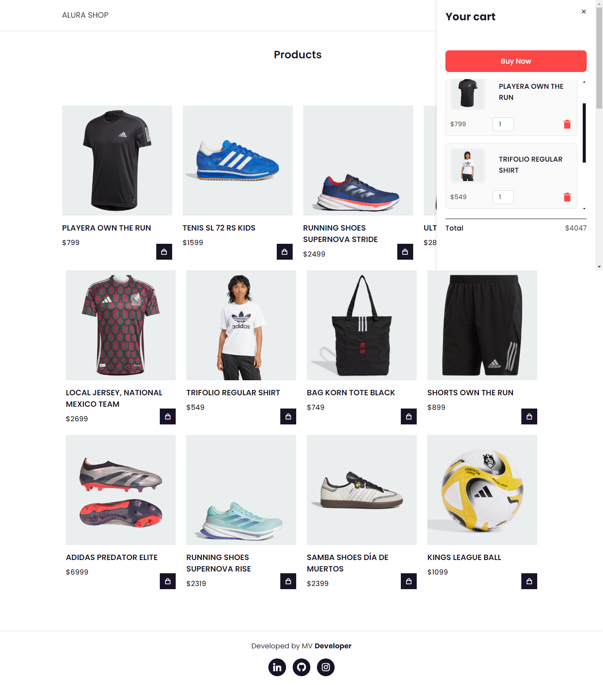
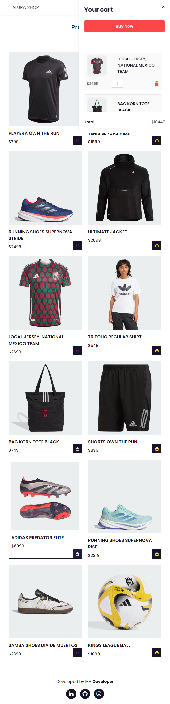
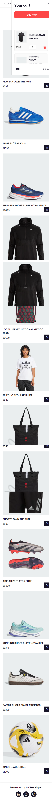

# ¡Hola, bienvenido a mi proyecto de Alura Shop (Alura Geek Challenge)!!

Este es el resultado final de mi proyecto de Formación Frontend del programa "Oracle Next Education.

Consiste en una Ecommerce que mediante FETCH hace una petición GET para acceder a una base de datos JSON (La cual fue creada por un servidor y está alojada de manera gratuita en el sitio "mockAPI" ), esta base de datos contiene elementos básicos de productos deportivos (Nombre, precio e imagen), para finalmente representar la Ecommerce que permite listar productos, agregar productos al carrito, modificar cantidades, calcular el total y procesar la compra. 

Esta aplicación es totalmente responsiva, adaptándose a dispositivos móbiles, tablet y PC de escritorio.

Versión Desktop:

Versión para tablet:

Versión para móvil:

## Herramientas utilizadas:

 

 

 

## Hecho por:

**Marco Pretelín Vergara**

 ## https://www.linkedin.com/in/marco-ariel-pretelin-vergara/